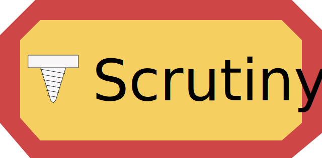
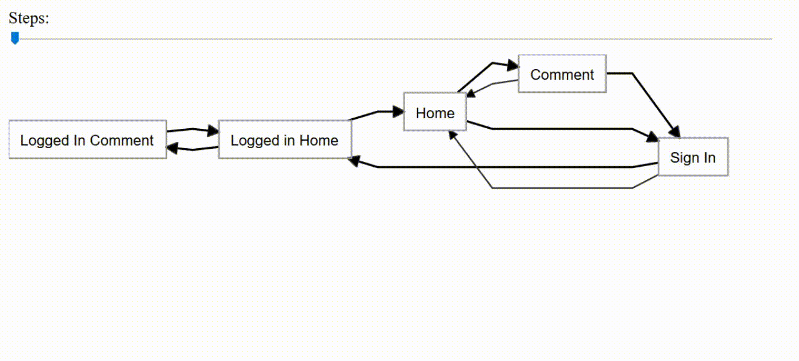

F# and C# library for testing state machines by randomly choosing available states and valid transitions. Designed for
usage with UI tests

 

## Description

Describe your UI as a state machine, and then use Scrutiny to simulate a "User" that randomly clicks around on your
site.
Scrutiny will attempt to create a Directed Adjacency Graph of your states, and then randomly choose an unvisited state
to navigate to.
It will repeat this process until all states have been visited.
During each state, Scrutiny will attempt to run any defined actions within that state.
Once all states have been visited, if an exit action has been defined it will then navigate there and quit.
Scrutiny will then also generate an HTML file which visualizes the State Machine as a graph.

Scrutiny was designed to run UI tests, but using e.g. CanopyUI or Selenium is only an implementation detail. In theory,
any state machine can be tested with Scrutiny.

---

There are several usage example projects in the `usageExamples` directory, implemented using different technologies. The
first two are implemented in F#, and the third one in C#.

* [Canopy UsageExample](usageExamples/UsageExample.Canopy) for a sample test implemented
  with [CanopyUI](https://github.com/lefthandedgoat/canopy)
* [Playwright UsageExample](usageExamples/UsageExample.Playwright) for a sample test implemented
  with [PlaywrightSharp](https://github.com/microsoft/playwright-sharp)
* [C# UsageExample](usageExamples/UsageExample.CSharp) for a sample test implementation also using Playwright, but this
  time with C#

A tiny sample site exists in the [Usage Example directory](usageExamples/Web). This is the website that the usage
examples are testing. It features three pages, a home page, comment page, and a sign in page. A user can only leave a
comment if they are signed in.
The usage examples showcase a certain approach a developer can take as to how to model their web site as a state
machine. In this case, the home and comment page are each listed twice, once as logged out, and once as logged in.
This is only one way to handle this case, and the developer could choose to model it in any other way.

Scrutiny will also draw a diagram representing the system under test as has been modeled by the various `page`s.
The [Sample Web site](usageExamples/Web) looks like this:

# Usage

  
<i>Click</i> for F# documentation

Define one `page` object for each state in your UI. A state can be anything from a page, or an individual modal, or the
same page as a different state, but altered, for example a logged in user.

The possible custom operations are:

- `name`: Name of the state. Required
- `onEnter`: Function to run when entering this page. Only one allowed
- `onExit`: Function to run when exiting this page. Only one allowed
- `transition`: Possible transition. Define how to transition to the next state, as well as which state to navigate to.
  Any number of transitions allowed
- `action`: Possible action. Define function to run while in this page state. Any number of actions allowed

A `page` looks like this:

    let loggedInComment = fun (globalState: GlobalState) ->
        page {
            name "Logged In Comment"

            onEnter (fun ls ->
                printfn "Checking on page comment"
                "#header" == "Comments"
            )

            onExit (fun _ ->
                printfn "Exiting comment"
            )

            transition {
                via (fun ls -> click ls.HomeLink)
                destination home
            }
            transition {
                via (fun _ -> click "#signin")
                destination signIn
            }

            action {
                fn (fun _ -> () (*do something on the page*))
            }
            action {
                fn (fun _ -> () (*do something else on the page*))
            }
            action {
                isExit
                fn (fun _ -> () (*final action to perform before exiting the test*))
            }
        }

The `name` must be unique. Any number of `transition`s and any number of `action`s can be defined. The `onEnter` function will be executed everytime scrutiny transitions to this state, and `onExit` will execute everytime scrutiny leaves this state. `name`, `onEnter`, and `onExit` must be defined before any `transition`s and `action`s.

Any `action` can be be marked as `isExit`, and multiple `page`s can have an `action` that is the exit action. If
multiple are defined, Scrutiny will randomly choose one to perform.
The `GlobalState` in the example is any type defined in your test that you can use to pass data between states,
e.g. `Username` or `IsLoggedIn`

`action`s are defined as follow within a page CE:

    page {
        name "something"

        action {
            name "Name of action"
            dependantActions [ "Other action" ]
            isExit
            fn (fun _ -> (*This is the function that gets run*))
        }
    }

The `name` defines a name for this `action`. Optional. This is how this action is reffered to when another action or
transition depends on it
The `dependantActions` list defines any actions that will be run before this action is run. Optional
The `isExit` marks this action as a potential exit action. Optional
The `fn` is the actual function to run as this action. Required

`transition`s are defined as follows within a page CE:

    page {
        name "something"

        transition {
            dependantActions [ "Other action" ]
            via (fun _ -> (*how to transition to the next state*))
            destination otherPage
        }
    }

The `dependantActions` list defines any actions that will be run before this action is run. Optional
The `via` function is executed that will actually transition the state machine to the next state. Required
The `destination` is the state that will be transitioned to. Required

### Configuration

Some things can be configured via `ScrutinyConfig`. The default config is:

    { ScrutinyConfig.Seed = Environment.TickCount
      MapOnly = false
      ComprehensiveActions = true
      ComprehensiveStates = true
      ScrutinyResultFilePath = Directory.GetCurrentDirectory() + "/ScrutinyResult.html"
      Logger = printfn "%s" }

`Seed` is printed during each test to be able to recreate a specific test run.
`MapOnly` won't run the test at all, but only generate the HTML Graph report.
`ComprehensiveActions` will run ALL defined actions anytime it enters a state with actions defined. If false, it will
run a random subset of actions.
`ComprehensiveStates` will visit ALL states in the state machine. If this is false, then it will visit at least half of
all states before randomly quitting.
`ScrutinyResultFilePath` is the directory and specified file name that the generated HTML report will be saved in
`Logger` is how individual messages from scrutiny will be logged. The signature is `string -> unit`. This is useful for
things like XUnit that bring their own console logging mechanism, or if you wanted to integrate a larger logging
framework.

To actually run the test, call the `scrutinize` function with your entry state, config, and global state object. e.g.

    // Sample Global State. This can be anything, and all page states will receive the same instance
    type GlobalState() =
        member val IsSignedIn = false with get, set
        member val Username = "MyUsername" with get, set
        member val Number = 42

    [<EntryPoint>]
    let main argv =
        let options = FirefoxOptions()
        do options.AddAdditionalCapability("acceptInsecureCerts", true, true)

        use ff = new FirefoxDriver(options)
        let currentDirectory = DirectoryInfo(Directory.GetCurrentDirectory())

        let config =
            { ScrutinyConfig.Default with
                  Seed = 553931187
                  MapOnly = false
                  ComprehensiveActions = true
                  ComprehensiveStates = true
                  ScrutinyResultFilePath = currentDirectory.Parent.Parent.Parent.FullName + "/myResult.html" }

        // Start tests. In this case we're using CanopyUI, but can be any test runner e.g. XUnit or Expecto
        // Start CanopyUI tests
        "Scrutiny" &&& fun _ ->
            printfn "opening url"
            url "https://localhost:5001/home"

            let gs = GlobalState()

            // The call to start Scrutiny, and construct a graph and "click" through all states
            scrutinize config gs home
            // or
            // scrutinizeWithDefaultConfig gs home

        switchTo ff
        pin canopy.types.direction.Right

        run()
        quit ff

        0

At the end of the run, Scrutiny will return an object which contains the generated adjacency graph, as well as a list of
individual steps taken, along with the actions performed in each state.

#### Important note for F# users

As the transitions ultimately depict a cyclic graph, it is necessary to declare module or namespace as recursive so that
pages defined later can be referenced by pages earlier. Note the usage of the `rec` keyword.
e.g.:

    module rec MyPages =
        let firstPage = fun (globalState: GlobalState) ->
            page {
                name "First Page"
                transition {
                    via (fun _ -> click "#second")
                    destination secondPage
                }
            }

        let secondPage = fun (globalState: GlobalState) ->
            page {
                name "Second Page"
                transition {
                    via (fun _ -> click "#first")
                    destination firstPage
                }
            }

  
<i>Click</i> for C# documentation

Define one class for each state in your UI, and decorate it with the `PageState` attribute. A state can be anything from
a page, or an individual modal, or the same page as a different state, but altered, for example a logged in user.

The possible attributes are:

- `PageState`: Define a class as a Page state.
- `OnEnter`: Function to run when entering this page. Only one allowed
- `OnExit`: Function to run when exiting this page. Only one allowed
- `TransitionTo`: Possible transition. Define how to transition to the next state, as well as which state to navigate
  to. Any number of transitions allowed
- `Action`: Possible action. Define function to run while in this page state. Any number of actions allowed. Optionally
  can be configured to be an exit action via the property `IsExit`
- `DependantAction`: Takes a string as a parameter. Only valid on Transitions and Actions. References an action that
  should be run before this action/transition. Multiple dependant actions can be referenced per action/transition

A `PageState` could look like this:

    using Scrutiny.CSharp;

    [PageState]
    public class LoggedInComment
    {
        private readonly GlobalState globalState;

        public LoggedInComment(GlobalState globalState)
        {
            // Construct anything necessary.
            // The constructor is called everytime Scrutiny navigates to this state
        }

        [OnEnter]
        public void OnEnter()
        {
            // Do something when scrutiny enters this state
            // Can optionally be async/await
            // Can only define one
        }

        [Action]
        public async Task WriteComments()
        {
            // Do something on the page
            // Can optionally be non-async
            // Define any number of these
        }

        [Action(IsExit = true)]
        public async Task ExitAction()
        {
            // Something to exit the state, and end the scrutinization
        }

        [OnExit]
        public void OnExit()
        {
            // Do something when scrutiny exits this state
            // Can optionally be async/await
            // Can only define one
        }

        [ExitAction]
        public async Task ExitAction()
        {
            // One exit actions amongst all page states is chosen
            // Define any number of these
            // Can optionally be non-async
        }

        [TransitionTo(nameof(AnotherState))]
        [DependantAction(nameof(WriteComments))] // Optioanlly run the WriteComments action before executing this transition
        public void TransitionToAnotherState()
        {
            // Code to perform state transition
            // Define any number of these
            // Can optionally be async/await
        }
    }

### Configuration

Some things can be configured via the `Scrutiny.CSharp.Configuration.Configuration` POCO. The default config is:

    Seed = Environment.TickCount
    MapOnly = false
    ComprehensiveActions = true
    ComprehensiveStates = true
    ScrutinyResultFilePath = Directory.GetCurrentDirectory() + "/ScrutinyResult.html"
    Logger = (Action<string>)((s) => Console.WriteLine(s))

`Seed` is printed during each test to be able to recreate a specific test run.
`MapOnly` won't run the test at all, but only generate the HTML Graph report.
`ComprehensiveActions` will run ALL defined actions anytime it enters a state with actions defined. If false, it will
run a random subset of actions.
`ComprehensiveStates` will visit ALL states in the state machine. If this is false, then it will visit at least half of
all states before randomly quitting.
`ScrutinyResultFilePath` is the directory and specified file name that the generated HTML report will be saved in
`Logger` is how individual messages from scrutiny will be logged. This is useful for things like XUnit that bring their
own console logging mechanism, or if you wanted to integrate a larger logging framework.

To actually run the test, call the `Scrutiny.CSharp.Scrutinize.Start<Home>(gs, config)` method. It takes your entry
state as a generic type argument, and a constructed global state object as well as your config as parameters.

    using Scrutiny.CSharp;

    [Fact]
    public async Task WithAttrs()
    {
        var browser = await playwright.Firefox.LaunchAsync(headless: false);
        var context = await browser.NewContextAsync(ignoreHTTPSErrors: true);
        var page = await context.NewPageAsync();

        await page.GoToAsync("https://127.0.0.1:5001/home");

        var config = new Configuration
        {
            Seed = 553931187,
            MapOnly = false,
            ComprehensiveActions = true,
            ComprehensiveStates = true
        };

        var gs = new GlobalState(page, outputHelper);
        var result = Scrutinize.Start<Home>(gs, config);

        Assert.Equal(7, result.Steps.Count());
        Assert.Equal(5, result.Graph.Count());
    }

The global state can be any class you want it to be. Scrutiny will pass the instance that is passed into the start
around to each `PageState` it visits.
At the end of the run, Scrutiny will return an object which contains the generated adjacency graph, as well as a list of
individual steps taken, along with the actions performed in each state.

## Development

To run the usage examples, you must start the [web project](usageExamples/Web).

The HTML report is a single file with all javascript written inline

---

## Sponsor

Thank you to [Valora](https://valora.digital) for sponsoring this project:

---

### Donations

Donations are greatly appreciated, but not needed at all. Please only donate if you are in a position to be able to
afford it, and only if you truly believe in the gift of giving.

Liberapay: 

  
<i>Click</i> for cryptocurrency links

Ethereum: `0x05f231D19c19A2111fe03c923F26813Bad43B57f`

Cardano ADA: `addr1qx35nmy62dfp3n5tqgga92gxcnq5vkvflw963yg7fm5e5my68x9frc2qq0r8nstjtnjcrcnpmtpzwvp0sqz46y4ykrmqrd4dg9`

